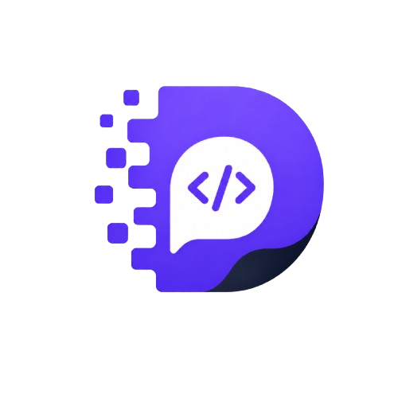

<div align="center">
  
  <h1 align="center">DevCommons 🚀</h1>
  <p align="center">
    <strong>Dasturchilar va AI muhandislari uchun ochiq resurslar, kod snippetlari hamda promptlar platformasi</strong><br>
    <em>Dunyodagi va O'zbekistondagi dasturchilarni birlashtirib, bilim va tajriba almashuvini yuqori bosqichga olib chiish imkoniyati.</em>
  </p>

  <p align="center">
    <a href="README.md">🌐 English</a> | <b>🇺🇿 O'zbek</b> | <a href="README.ru.md">🇷🇺 Русский</a>
  </p>

  <p align="center">
    <a href="https://github.com/OgabekHub/devcommons/blob/main/LICENSE"></a>
    <a href="https://nextjs.org"></a>
    <a href="https://supabase.com"></a>
    <a href="https://github.com/OgabekHub/devcommons/blob/main/CONTRIBUTING.md"></a>
  </p>
</div>

---

## 🌟 Loyiha Haqida

**DevCommons** — bu zamonaviy IT jamoatchiligi uchun mo'ljallangan 100% ochiq manbali global platformadir. Dasturchilar o'ularining kundalik hayotida foydalanyotgan eng samarali **kod snippetalarini**, ularni befarib **brauzer o'zida jonli ishlatib sinash imkoniyatini (Live Preview)** va **ChatGPT, Claude hamda Gemini AI Prompt'larini** bepul bo'lishishadi.

O'zbekiston dasturchilar jamoatchiligi tomonidan mehr va katta maqsadlarda shakllangan ushbu resurs bugungi kunda barcha hududlardagi kadr va AI muhandislarini bir qomat shaklda birlashmasi munosibdir.

---

## ✨ Imkoniyatlari

- 🖥️ **Monaco Code Editor:** VS Code tajribasi asosidagi kuchli va interaktiv kod muharriri.
- ⚡ **Sandpack Live Preview:** React, Node.js yoki Vanilla JavaScript kodining brauzerning o'zidayoq jonli o'rnatilib ishalb ko'rsatilishi!
- 🤖 **AI Prompts & Tayyor Shablonlar:** 6+ xil mashhur arxitektura shablonlari (React Components, Next.js API, Express, FastAPI, Docker, SQL) 1 soniyada to'ldirib beriladi.
- 🎨 **Sakramas Premium UI/UX:** Vercel va Apple dizayn tajribasi asosinig mukammal silliqligiga ega kartalar (Zero layout shifting, subpixel jittermamsizlik).
- 🌍 **3 Xil Til (i18n):** Tizim to'liq **O'zbek**, **Ingliz** va **Rus** tillarida lokalizatsiya qilingan va URL protokolda moslashtiringaladi.
- 📊 **Vercel-style Boshqaruv Kartalari:** Shaxsiy profil, tab tizimi va yuksaltirmaliki statistika kartalar to'plami.
- 🔐 **GitHub Auth & API Kalitlar:** Bir bosish vasitasita tezkor ro'yxatdan kiring va dasturchilik tokenlarni yaratmishi beringiz.

---

## 🛠️ Texnologiyalar

- **Framework:** [Next.js 14](https://nextjs.org/) (App Router & SSR)
- **Database & Auth:** [Supabase](https://supabase.com/) (PostgreSQL, RLS, OAuth)
- **Styling:** Vanilla CSS & Tailwind CSS (Custom design tokenlar, Glassmorphism, Zero-jitter)
- **Editor:** `@monaco-editor/react`, `@codesandbox/sandpack-react`
- **Tarjima tizimi:** `next-intl`
- **Animatsiya va Ikonlar:** `framer-motion`, `lucide-react`

---

## 🚀 Tezkor Ishga Tushirish

Loyihani o'z kompyuteringizda ishlanib ko'rish yoki jami kiritish takliflarini jo'natishingiz 3 daqiqadan osonroqsidir:

### 1. Loyihani yuklang (Clone Repo)
```bash
git clone https://github.com/OgabekHub/devcommons.git
cd devcommons
```

### 2. Paketlarni o'rnating
```bash
npm install
```

### 3. Env sirlilik fayllarini sozlang (`.env.local`)
`devcommons` ildiz papkasida `.env.local` nomli fayl ochib o'z Supabase ma'lumotangizi beringiz:
```env
NEXT_PUBLIC_SUPABASE_URL=your-supabase-url
NEXT_PUBLIC_SUPABASE_ANON_KEY=your-supabase-anon-key
SUPABASE_SERVICE_ROLE_KEY=your-service-role-key
```

### 4. Lokal Serverda yuklash
```bash
npm run dev
```
Brauzerningizga o'tirgancha `http://localhost:3000` ga kirsangiz **DevCommons** ochiydi!

---

## 🤝 Hissa Qo'shgandik va "AI PRs Welcome!"

Biz har qanday darajadali global, va albatta xalqona O'zbekistondagi a'zo dasturchilarimizni o'z pull rekoruvalarini (PR) topshiriganga xorsiz taklif etayomadi! 
> **🤖 AI / Vibe-coded PRs strictly welcomed and encouraged!**
> Buni qo'lda yozibsizgu yo Claude, Antigravity, Cursor kabin avtonom AI'larni ishlatasiz-ki, biz albatda sifat ochiqli pull requestlar barchasini quvonch ila olqishlashi qozonadi!

Batafsil [CONTRIBUTING.md](CONTRIBUTING.md) ko'rsatamizni o'zlashtirmasga chaqiradi.

---

## 📝 Litsenziya

Bu proyekt **MIT Litsenziyasi** bo'lim bo'ylab hamma uchun bepul va 100% erkin ochirilgandir!
